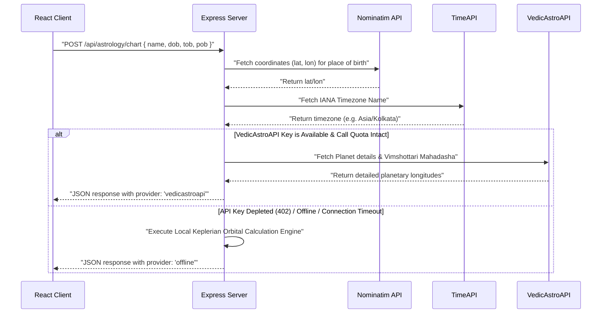

# Project Documentation - Astrologer CRM

This document contains comprehensive notes covering the tech stack, architecture, data schemas, calculation models, engineering assumptions, and roadmap for the **Astrologer CRM** application.

---

## 1. System Technology Stack

The Astrologer CRM is designed as a secure, production-ready full-stack web application:

### Frontend
- **Framework & Build Tool**: React 19 combined with Vite 6.
- **Language**: TypeScript (enforcing strict type safety across all astronomical models and state engines).
- **Styling & UI**: Tailwind CSS v4, custom HSL variable themes, custom glassmorphic cards, smooth transitions, and custom SVG visual charts.
- **Iconography**: Lucide React.
- **Data Visualization**: Recharts (for monthly revenue statistics, client growth rates, and appointment breakdowns).

### Backend
- **Runtime & Server**: Node.js running an Express 4 RESTful API server.
- **Language**: ES6 Javascript (using Native Modules `import`/`export`).
- **Database Layer**: MongoDB Atlas paired with Mongoose 9 for robust data validation.
- **Authentication**: JSON Web Token (JWT) with cookies/authorization headers and bcryptjs.

### Third-Party APIs (Proxied & Secured on Server)
- **Nominatim OpenStreetMap API**: Geocodes user birth town strings (e.g. "Mumbai, India") into precise latitude and longitude.
- **TimeAPI.io**: Resolves latitude/longitude coordinates to official IANA timezone identifiers (e.g. `Asia/Kolkata`) without exposing calls to client CORS limitations.
- **VedicAstroAPI**: Computes Vedic planetary coordinates, houses, and current Vimshottari Mahadasha sequences.

---

## 2. Directory Structure & Key Files

Here is an overview of the code organization:

```
├── backend/
│   ├── config/
│   │   └── db.js                  # MongoDB Mongoose connection handler
│   ├── controllers/
│   │   ├── authController.js      # User/Astrologer profile and auth handlers
│   │   ├── crmController.js       # Client management, invoices, and payments
│   │   ├── syncController.js      # Sync engine for offline local storage data
│   │   └── astrologyController.js  # Server-side geocoding & astronomical computations
│   ├── middleware/
│   │   ├── authMiddleware.js      # JWT verify and request context injection
│   │   └── errorMiddleware.js     # Global Express 404 & 500 handler stack
│   ├── models/
│   │   ├── User.js                # Astrologer profile & authentication schema
│   │   ├── Client.js              # Client details & assigned astrologer mapping
│   │   ├── Appointment.js         # Appointment bookings & payment reconciler fields
│   │   └── Payment.js             # Financial transaction records & invoices
│   ├── routes/
│   │   ├── authRoutes.js          # Authentication routing endpoints
│   │   ├── crmRoutes.js           # Client profiles & records endpoints
│   │   ├── syncRoutes.js          # Local Storage synchronization endpoints
│   │   └── astrologyRoutes.js     # Astrology computation POST proxy route
│   ├── index.js                   # Node Express server bootstrapper
│   └── seed_gurus.js              # Initial database seeder script for Astrologers
│
├── src/
│   ├── components/
│   │   ├── BirthChartWidget.tsx   # Interactive Birth Details Form & SVG Chart
│   │   ├── PlanetArc.tsx          # Dynamic 3D planet orbit selector panel
│   │   ├── PanelLayout.tsx        # Common shell for dashboard navigation
│   │   └── CosmicBackground.tsx   # Ambient orbital canvas background
│   ├── lib/
│   │   └── astrologyApi.ts        # Client POST wrapper to the backend proxy
│   ├── pages/
│   │   ├── client/
│   │   │   ├── BookAppointment.tsx # Client-Astrologer scheduling form
│   │   │   ├── Consultations.tsx  # Interactive consultation logs & notes
│   │   │   └── Payments.tsx       # Invoicing & payment reconciliation panel
│   │   └── astrologer/
│   │       ├── Reports.tsx        # Business Insights & rolling monthly revenues
│   │       ├── Settings.tsx       # Profile, specializations, & rates configuration
│   │       └── Availability.tsx   # Weekly availability grid & MongoDB Atlas publisher
│   ├── types.ts                   # Unified TypeScript definitions
│   └── vite.config.ts             # Vite server config & /api dev proxy rules
```

---

## 3. Database Schema Models (Mongoose)

### User Model (Astrologer)
Represents the registered astrologer.
- **Credentials**: `name`, `email` (unique), `password`.
- **Cosmic Specializations**: `specialization`, `languages` (languages spoken), `rating`, `experience` (in years), `bio`, `ratePerHour`.
- **System Role**: Defaults to `astrologer`.

### Client Model
Represents the consultation client.
- **Attributes**: `name`, `email`, `phone`, `zodiacSign`.
- **Vedic Details**: `dob` (Date of Birth), `tob` (Time of Birth), `pob` (Place of Birth).
- **Astrologer Assignment**: `astrologerId` (ObjectId referencing the User model). Dynamically updated during client appointment booking.

### Appointment Model
Represents bookings.
- **Details**: `clientName`, `clientEmail`, `date` (format `YYYY-MM-DD`), `timeSlot`.
- **Relational IDs**: `clientId` (ObjectId), `astrologerId` (ObjectId).
- **Payment Linkage**: `paymentStatus` (`Paid` vs `Unpaid`), `fee`.

### Payment Model
Represents financial statements and invoices.
- **Details**: `clientName`, `amount`, `status` (`Paid`, `Unpaid`, `Overdue`), `date`, `dueDate`.
- **Relational IDs**: `clientId` (ObjectId), `appointmentId` (ObjectId - crucial for ledger reconciliation).

---

## 4. The Celestial Calculation Flow & Fallback Mechanics

The geocoding, coordinates offset lookup, and astronomical mapping logic are fully managed on the backend to avoid browser CORS errors and key exposure:



### Local Astronomical Calculation Engine
If VedicAstroAPI is unavailable, the local astronomical engine executes server-side:
1. **Julian Date (JD) Calculation**: Computes the days elapsed since the J2000.0 epoch ($d = JD - 2451545.0$).
2. **Lahiri Ayanamsa Correction**:
   $$\theta_{Ayanamsa} = 23.85 + \frac{0.0139 \cdot d}{365.25}$$
3. **Ascendant (Lagna) Determination**: Computes Greenwich Sidereal Time (GMST) and Local Sidereal Time (LST) based on longitude. Resolves the Ascendant angle using the obliquity of the ecliptic ($\epsilon$):
   $$\tan \lambda_{Asc} = \frac{-\cos LST}{\sin LST \cos \epsilon + \tan \phi \sin \epsilon}$$
   Where $\phi$ is the latitude.
4. **Vimshottari Mahadasha Sequence**: Calculates the exact elapsed percentage of the dasha cycle based on the Moon's longitude relative to the Nakshatra boundaries ($13^\circ 20'$ per Nakshatra, cycled through the 9 Vedic planetary lords).

---

## 5. Key Engineering Assumptions & Reconciliations
- **Local Storage Synchronization**: Toggles modified offline on the client's availability portal are saved in local storage first, then bulk updated to MongoDB Atlas using an intermediary sanitizer `cleanUpdateData` that strips Mongo properties (like `_id`, `__v`) before database upserts.
- **Auto-Payment Reconciliation**: Clicking "Pay UPI Now" on the Client Invoices page maps the transaction's `appointmentId` and automatically switches the linked Appointment's `paymentStatus` to `"Paid"` in MongoDB.
- **Astrologer Assignment**: During client scheduling, the client's profile record dynamically updates its `astrologerId` to match the selected Pandit. This links directories and enables the Astrologer dashboard reports to calculate average ticket sizes and MoM client onboarding rates.

---

## 6. Future System Improvements
1. **Zodiac Interactive Sphere**: Render a interactive 3D WebGL stellar map representing real-time planetary transits using Keplerian formulas.
2. **WebRTC Video Rooms**: Build secure consultation chat channels and video call slots directly within the Astrologer CRM portal.
3. **SMS & WhatsApp Gateway**: Add an notification listener that dispatches automated invoice reminders and booking confirmation slots to clients.
4. **Export Engine**: Export monthly accounting ledger files (PDF/CSV) directly from the Astrologer CRM reports interface.
